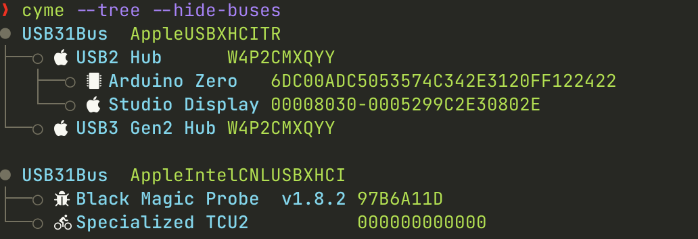

```bash
           o
      o   /---o
     /---/---o
o---/
     \---\---o
      o   \---o
            o
```
# Cyme

[](https://crates.io/crates/cyme)
[](https://docs.rs/cyme/latest/cyme/)

List system USB buses and devices; a lib and modern cross-platform `lsusb` that attempts to maintain compatibility with, but also add new features. Includes a macOS `system_profiler SPUSBDataType` parser module and libusb profiler for non-macOS systems/gathering more verbose information.

The project started as a quick replacement for the barely working [lsusb script](https://github.com/jlhonora/lsusb) and a Rust project to keep me up to date! Like most fun projects, it quickly experienced feature creep as I developed it into a cross-platform replacement for `lsusb`.

As a developer of embedded devices, I use a USB list tool on a frequent basis and developed this to cater to what I believe are the short comings of `lsusb`: verbose dump is too _verbose_, tree doesn't contain useful data on the whole, it barely works on non-Linux platforms and modern terminals support features that make glancing through the data easier.

It's not perfect as it started out as a Rust refresher but I had a lot of fun developing it and hope others will find it useful and can contribute. Reading around the [lsusb source code](https://github.com/gregkh/usbutils/blob/master/lsusb.c), USB-IF and general USB information was also a good knowledge builder.

The name comes from the technical term for the type of blossom on a Apple tree: [cyme](https://en.wikipedia.org/wiki/Inflorescence#Determinate_or_cymose) - it is Apple related and also looks like a USB device tree 😃🌸.



# Features

* Compatible with `lsusb` using `--lsusb` argument. Supports all arguments including `--verbose` output using libusb. Output is identical for use with no args (list), almost matching for tree (driver port number not included) and near match for verbose (missing full extended descriptor dump).
* Filters like `lsusb` but that also work when printing `--tree`. Adds `--filter_name`, `--filter_serial`, `--filter_class` and option to hide empty `--hide-buses`/`--hide-hubs`.
* Improved `--tree` mode; shows device, configurations, interfaces and endpoints as tree depending on level of `--verbose`.
* Controllable block data like `lsd --blocks` for device, bus, configurations, interfaces and endpoints. Use `--more` to see more by default.
* Modern terminal features with coloured output, utf-8 characters and icon look-up based device data. Can be turned off and customised. See `--encoding` (glyphs [default], utf8 and ascii), which can keep icons/tree within a certain encoding, `--color` (auto [default], always and never) and `--icon` (auto [default], always and never). Auto `--icon` will only show icons if all icons to be shown are supported by the `--encoding`.
* Can be used as a library too with `system_profiler` parsing module, `lsusb` module using libusb and `display` module for printing amongst others.
* `--json` output that honours filters and `--tree`.
* `--headers` to show meta data only when asked and not take space otherwise.
* `--mask_serials` to either '\*' or randomise serial string for sharing dumps with sensitive serial numbers.
* Auto-scaling to terminal width. Variable length strings such as descriptors will be truncated with a '...' to indicate this. Can be disabled with config option 'no-auto-width' and a fixed max defined with 'max-variable-string-len'.
* Targets for Linux, macOS and Windows.

## Demo

[](https://asciinema.org/a/IwYyZMrGMbXL4g15qDIaUViyM)

# Install

## Requirements

* Linux/Windows and pre-compiled targets require [libusb 1.0.0](https://libusb.info): `brew install libusb`, `sudo apt install libusb-1.0-0-dev` or one's package manager of choice.

For pre-compiled binaries, see the [releases](https://github.com/tuna-f1sh/cyme/releases).

From crates.io with a Rust tool-chain installed: `cargo install cyme`. To do it from within a local clone: `cargo install --path .`.

If wishing to use only macOS `system_profiler` and not obtain more verbose information, remove the 'libusb' feature with `cargo install --no-default-features cyme`

### Package Managers

* Homebrew tap, which will also install a man page, completions and the 'libusb' dependency: 

```bash
brew install tuna-f1sh/taps/cyme
```

* [Arch AUR 'cyme-bin'](https://aur.archlinux.org/packages/cyme-bin)
* [Debian packages as part of release](https://github.com/tuna-f1sh/cyme/releases) - need a Debian maintainer for this.

More package managers to come/package distribution, please feel free to create a PR if you want to help out here.

## Linux udev

> [!NOTE]
> Only supported on Linux targets.

To obtain device and interface drivers being used on Linux like `lsusb`, one can use the `--features udev` feature when building - it's a default feature. The feature uses the Rust crate [udevrs](https://crates.io/crates/udevrs) to obtain the information. To use the C FFI libudev library, use `--no-default-features --features udevlib` which will use the 'libudev' crate. Note that this will require 'libudev-dev' to be installed on the host machine.

To lookup USB IDs from the udev hwdb as well (like `lsusb`) use `--features udev_hwdb`. Without hwdb, `cyme` will use the 'usb-ids' crate, which is the same source as the hwdb binary data but the bundled hwdb may differ due to customisations or last update ('usb-ids' will be most up to date).

## Alias `lsusb`

If one wishes to create a macOS version of lsusb or just use this instead, create an alias one's environment with the `--lsusb` compatibility flag:

`alias lsusb='cyme --lsusb'`

# Usage

Will cover this more as it develops. Use `cyme --help` for basic usage or `man ./doc/cyme.1`. There are also autocompletions in './doc'.

## Crate

For usage as a library for profiling system USB devices, the crate is 100% documented so look at [docs.rs](https://docs.rs/cyme/latest/cyme/). The main useful modules for import are [system_profiler](https://docs.rs/cyme/latest/cyme/system_profiler/index.html), [lsusb::profiler](https://docs.rs/cyme/latest/cyme/lsusb/profiler/index.html) and [usb](https://docs.rs/cyme/latest/cyme/usb/index.html)

There are also some examples in 'examples/', these can be run with `cargo run --example filter_devices`.

## Config

`cyme` will check for a 'cyme.json' config file in:

* Linux: "$XDG\_CONFIG\_HOME/cyme or $HOME/.config/cyme"
* macOS: "$HOME/Library/Application Support/cyme"
* Windows: "{FOLDERID\_RoamingAppData}/cyme"

One can also be supplied with `--config`. Copy or refer to './doc/cyme\_example\_config.json' for configurables. Tthe file is essentially the default args; supplied args will override these. Use `--debug` to see where it is looking or if it's not loading.

### Custom Icons and Colours

See './doc/cyme\_example\_config.json' for an example of how icons can be defined and also the [docs](https://docs.rs/cyme/latest/cyme/icon/enum.Icon.html). The config can exclude the "user"/"colours" keys if one wishes not to define any new icons/colours.

Icons are looked up in an order of User -> Default. For devices: `VidPid` -> `VidPidMsb` -> `Vid` -> `UnknownVendor` -> `get_default_vidpid_icon`, classes: `ClassifierSubProtocol` -> `Classifier` -> `UndefinedClassifier` -> `get_default_classifier_icon`. User supplied colours override all internal; if a key is missing, it will be `None`.

#### Icons not Showing/Boxes with Question Marks

Copied from [lsd](https://github.com/lsd-rs/lsd#icons-not-showing-up): For `cyme` to be able to display icons, the font has to include special font glyphs. This might not be the case for most fonts that you download. Thankfully, you can patch most fonts using [NerdFont](https://www.nerdfonts.com/) and add these icons. Or you can just download an already patched version of your favourite font from [NerdFont font download page](https://www.nerdfonts.com/font-downloads).
Here is a guide on how to setup fonts on [macOS](https://github.com/Peltoche/lsd/issues/199#issuecomment-494218334) and [Android](https://github.com/Peltoche/lsd/issues/423).

To check if the font you are using is setup correctly, try running the following snippet in a shell and see if that [prints a folder icon](https://github.com/Peltoche/lsd/issues/510#issuecomment-860000306). If it prints a box, or question mark or something else, then you might have some issues in how you setup the font or how your terminal emulator renders the font.

```sh
echo $'\uf115'
```

If one does not want icons, provide a config file with custom blocks not including the any 'icon\*' blocks - see the example config. Alternatively, to only use standard UTF-8 charactors supported by all fonts (no private use area) pass `--encoding utf8` and `--icon auto` (default). The `--icon auto` will drop the icon blocks if the charactors matched are not supported by the `--encoding`.

For no icons at all, use the hidden `--no-icons` or `--icon never` args.

# Known Issues

* `sudo` is required to open and read Linux root\_hub string descriptors. The program works fine without these however, as will use sysfs/hwdb/'usb-ids' like lsusb. Use debugging `-z` to see what devices failed to read. The env CYME_PRINT_NON_CRITICAL_PROFILER_STDERR can be used or 'print-non-critical-profiler-stderr' config key to print these to stderr. `--lsusb --verbose` will print a message to stderr always to match the 'lsusb' behaviour.
* Version major BCD Device difference between libusb and macOS `system_profiler`: If the major version is large, libusb seems to read a different value to macOS. I don't think it's a parsing error but open to ideas.
* libusb cannot read special non-user Apple buses; T2 chip for example. These will still be listed by `system_profiler`. The result is that when merging for verbose data, these will not print verbose information. Use `--force-libusb` to ignore them.
* Tested with macOS 13 ->. I'm not sure when the `-json` flag was added to `system_profiler`; whether it exists on all macOS versions.
