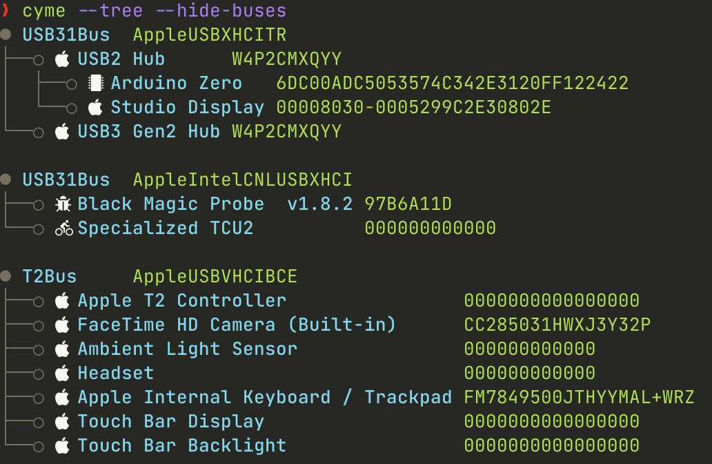

```
           o
      o   /---o
     /---/---o
o---/
     \---\---o
      o   \---o
            o
```
# Cyme

List system USB buses and devices; a modern `lsusb` that attempts to maintain compatibility with, but also add new features. Includes a macOS `system_profiler SPUSBDataType` parser module and libusb tool for non-macOS systems/gathering more verbose information.

The project started as a quick replacement for the barely working [lsusb script](https://github.com/jlhonora/lsusb) and is my _yearly_ Rust project to keep up to date! It is currently in flux as I build the foundations, learn about custom serde Deserializers and newer Rust features.

The name comes from the technical term for the type of blossom on a Apple tree: [cyme](https://en.wikipedia.org/wiki/Inflorescence#Determinate_or_cymose) - it is Apple related and also looks like a USB device tree 😃🌸.



# Features

* Compatible with `lsusb` using `--lsusb` argument. Supports all arguments including `--verbose` output using libusb.
* Filters like `lsusb` but that also work when printing `--tree`. Adds `--filter_name`, `--filter_serial` and option to hide empty `--hide-buses`/`--hide-hubs`.
* Improved `--tree` mode.
* Modern terminal features with coloured output, utf-8 characters and icons. Can be turned off and customised.
* Can be used as a library too with `system_profiler` parsing module, `lsusb` module using libusb and `display` module for printing amoungst others.
* `--json` output that honours filters and `--tree`.

## Planned Features for 1.0.0 Release

- [x] Controllable block data like `lsd --blocks`
- [x] Modern drawing of device tree with utf-8 boxes.
- [x] Nerd font icon look up and icon theming like `lsd --icon`.
- [x] libusb optional to get more USB data and support other OS with switch from `system_profiler`.
- [x] Group by in list mode.
- [ ] Interface and Device Descriptor icon look up.
- [ ] Drawing of headers.
- [ ] Tree support of all device interfaces and endpoints.
- [ ] User defined icon map and colour import.
- [ ] udev support on Linux to get device driver etc.

# Install

From crates.io with a Rust tool-chain installed: `cargo install cyme`. If wishing to do it from within a local clone: `cargo install --path .`.

If wishing to use only macOS `system_profiler` and not more verbose information, remove the 'libusb' feature with `cargo install --no-default-features cyme`

I also have a Homebrew tap: `brew tap tuna-f1sh/cyme`.

## Alias `lsusb`

If you want to create a macOS version of lsusb, create an alias in your environment with the `--lsusb` compatibility flag:

`alias lsusb='cyme --lsusb'`

Examples output:

```
> lsusb
Bus 000 Device 001: ID 0bda:0411 4-Port USB 3.0 Hub
Bus 002 Device 002: ID 043e:9a60 USB3.1 Hub
Bus 002 Device 007: ID 0781:558c Extreme SSD
Bus 002 Device 008: ID 0bda:8153 Belkin USB-C LAN
Bus 002 Device 005: ID 2109:2817 USB2.0 Hub
```

# Usage

Will cover this more as it develops. Use `cyme --help` for basic usage.
